# NEXORA — User Journeys and Application Flow

**Document ID:** DOC-004  
**Version:** 1.0  
**Status:** Draft  
**Created:** 2026-10-09  
**Last Updated:** 2026-10-09  

---

## 1. Primary User Personas and Responsibilities

### Venue Safety Operator (Ananya)
- Uploads video footage for analysis
- Reviews detection results and evidence
- Assesses crowd events (acknowledge/dismiss/escalate)
- Examines venue routes and manages walkway status
- Creates and manages incidents
- Assigns response resources

### Operations Commander (Rajesh)
- Reviews dashboard for situational awareness
- Monitors incident status and trends
- Reviews audit trail for accountability
- Escalation decision-maker

## 2. End-to-End Operator Journey

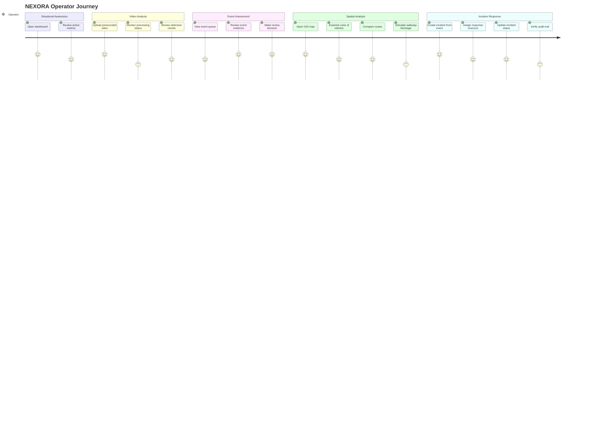
```mermaid
journey
    title NEXORA Operator Journey
    section Situational Awareness
      Open dashboard: 5: Operator
      Review active metrics: 4: Operator
    section Video Analysis
      Upload prerecorded video: 5: Operator
      Monitor processing status: 3: Operator
      Review detection results: 4: Operator
    section Event Assessment
      View event queue: 4: Operator
      Review event evidence: 5: Operator
      Make review decision: 5: Operator
    section Spatial Analysis
      Open GIS map: 5: Operator
      Examine zone of interest: 4: Operator
      Compare routes: 4: Operator
      Simulate walkway blockage: 3: Operator
    section Incident Response
      Create incident from event: 5: Operator
      Assign response resource: 4: Operator
      Update incident status: 4: Operator
      Verify audit trail: 3: Operator
```

## 3. Video Upload and Analysis Flow

### 3.1 Normal Flow

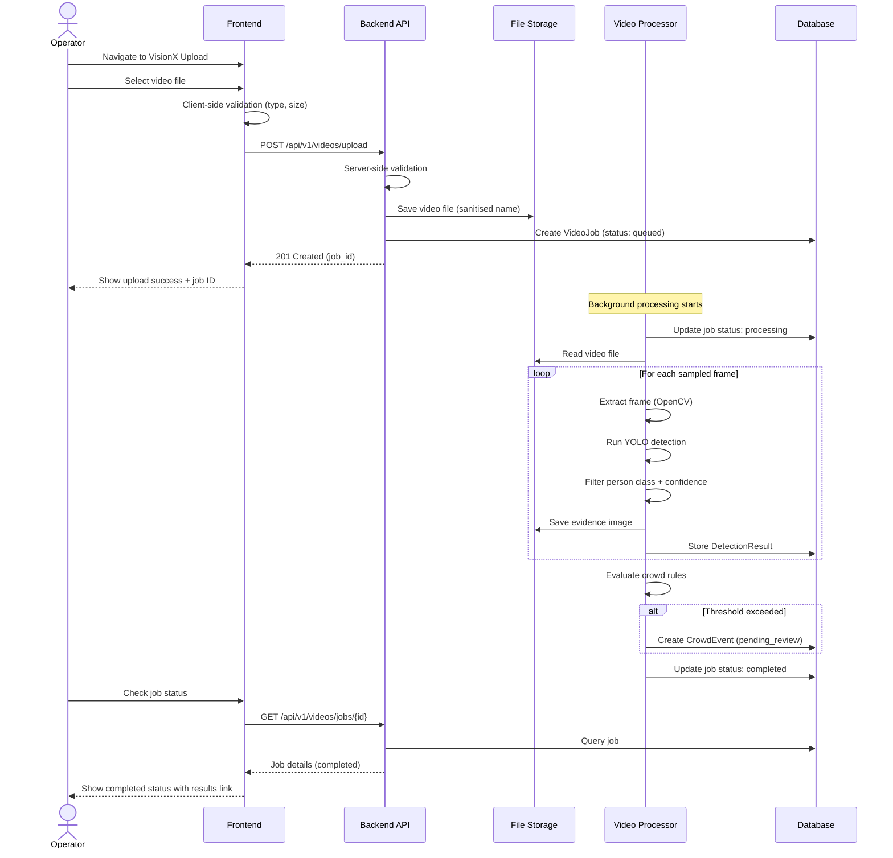
```mermaid
sequenceDiagram
    actor Op as Operator
    participant UI as Frontend
    participant API as Backend API
    participant FS as File Storage
    participant VP as Video Processor
    participant DB as Database
    
    Op->>UI: Navigate to VisionX Upload
    Op->>UI: Select video file
    UI->>UI: Client-side validation (type, size)
    UI->>API: POST /api/v1/videos/upload
    API->>API: Server-side validation
    API->>FS: Save video file (sanitised name)
    API->>DB: Create VideoJob (status: queued)
    API-->>UI: 201 Created (job_id)
    UI-->>Op: Show upload success + job ID
    
    Note over VP: Background processing starts
    VP->>DB: Update job status: processing
    VP->>FS: Read video file
    
    loop For each sampled frame
        VP->>VP: Extract frame (OpenCV)
        VP->>VP: Run YOLO detection
        VP->>VP: Filter person class + confidence
        VP->>FS: Save evidence image
        VP->>DB: Store DetectionResult
    end
    
    VP->>VP: Evaluate crowd rules
    
    alt Threshold exceeded
        VP->>DB: Create CrowdEvent (pending_review)
    end
    
    VP->>DB: Update job status: completed
    
    Op->>UI: Check job status
    UI->>API: GET /api/v1/videos/jobs/{id}
    API->>DB: Query job
    API-->>UI: Job details (completed)
    UI-->>Op: Show completed status with results link
```

### 3.2 Error Flow — Invalid Upload

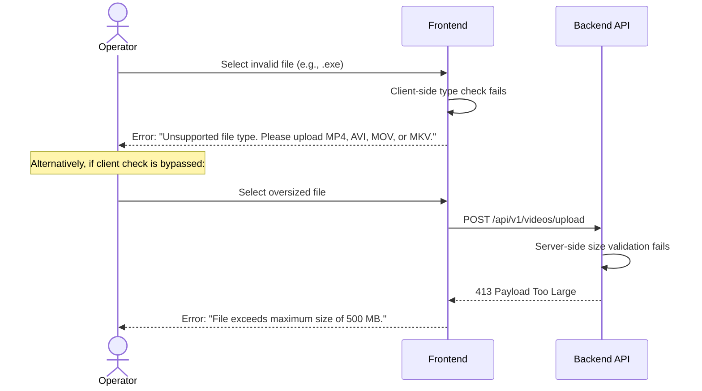
```mermaid
sequenceDiagram
    actor Op as Operator
    participant UI as Frontend
    participant API as Backend API
    
    Op->>UI: Select invalid file (e.g., .exe)
    UI->>UI: Client-side type check fails
    UI-->>Op: Error: "Unsupported file type. Please upload MP4, AVI, MOV, or MKV."
    
    Note over Op: Alternatively, if client check is bypassed:
    Op->>UI: Select oversized file
    UI->>API: POST /api/v1/videos/upload
    API->>API: Server-side size validation fails
    API-->>UI: 413 Payload Too Large
    UI-->>Op: Error: "File exceeds maximum size of 500 MB."
```

### 3.3 Error Flow — Processing Failure

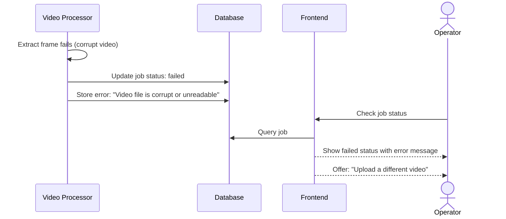
```mermaid
sequenceDiagram
    participant VP as Video Processor
    participant DB as Database
    participant UI as Frontend
    actor Op as Operator
    
    VP->>VP: Extract frame fails (corrupt video)
    VP->>DB: Update job status: failed
    VP->>DB: Store error: "Video file is corrupt or unreadable"
    
    Op->>UI: Check job status
    UI->>DB: Query job
    UI-->>Op: Show failed status with error message
    UI-->>Op: Offer: "Upload a different video"
```

### 3.4 Empty State — No Videos

When the operator navigates to VisionX with no uploaded videos:
- Display empty state illustration
- Message: "No videos uploaded yet"
- CTA: "Upload Your First Video" button
- Brief instruction text explaining the workflow

## 4. Event Review Flow

### 4.1 Normal Flow

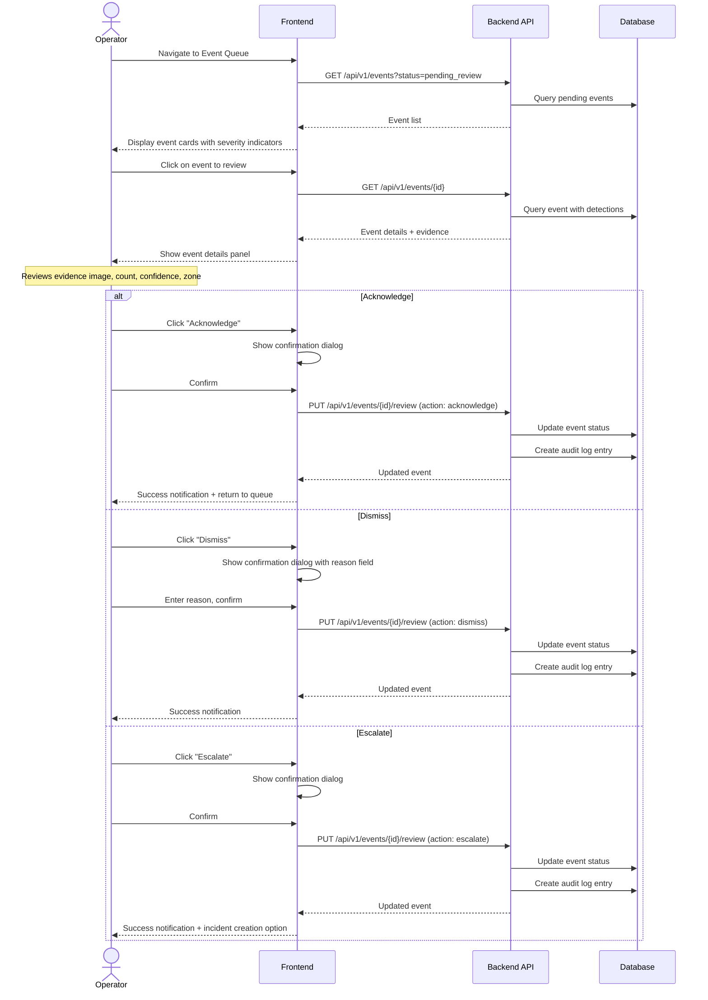
```mermaid
sequenceDiagram
    actor Op as Operator
    participant UI as Frontend
    participant API as Backend API
    participant DB as Database
    
    Op->>UI: Navigate to Event Queue
    UI->>API: GET /api/v1/events?status=pending_review
    API->>DB: Query pending events
    API-->>UI: Event list
    UI-->>Op: Display event cards with severity indicators
    
    Op->>UI: Click on event to review
    UI->>API: GET /api/v1/events/{id}
    API->>DB: Query event with detections
    API-->>UI: Event details + evidence
    UI-->>Op: Show event details panel
    
    Note over Op: Reviews evidence image, count, confidence, zone
    
    alt Acknowledge
        Op->>UI: Click "Acknowledge"
        UI->>UI: Show confirmation dialog
        Op->>UI: Confirm
        UI->>API: PUT /api/v1/events/{id}/review (action: acknowledge)
        API->>DB: Update event status
        API->>DB: Create audit log entry
        API-->>UI: Updated event
        UI-->>Op: Success notification + return to queue
    else Dismiss
        Op->>UI: Click "Dismiss"
        UI->>UI: Show confirmation dialog with reason field
        Op->>UI: Enter reason, confirm
        UI->>API: PUT /api/v1/events/{id}/review (action: dismiss)
        API->>DB: Update event status
        API->>DB: Create audit log entry
        API-->>UI: Updated event
        UI-->>Op: Success notification
    else Escalate
        Op->>UI: Click "Escalate"
        UI->>UI: Show confirmation dialog
        Op->>UI: Confirm
        UI->>API: PUT /api/v1/events/{id}/review (action: escalate)
        API->>DB: Update event status
        API->>DB: Create audit log entry
        API-->>UI: Updated event
        UI-->>Op: Success notification + incident creation option
    end
```

### 4.2 Empty State — No Events

- Display: "No events to review"
- Instruction: "Events are automatically created when crowd-count thresholds are exceeded during video processing."
- Link: "Upload a Video" → navigates to VisionX upload

## 5. GIS Route Comparison Flow

### 5.1 Normal Flow

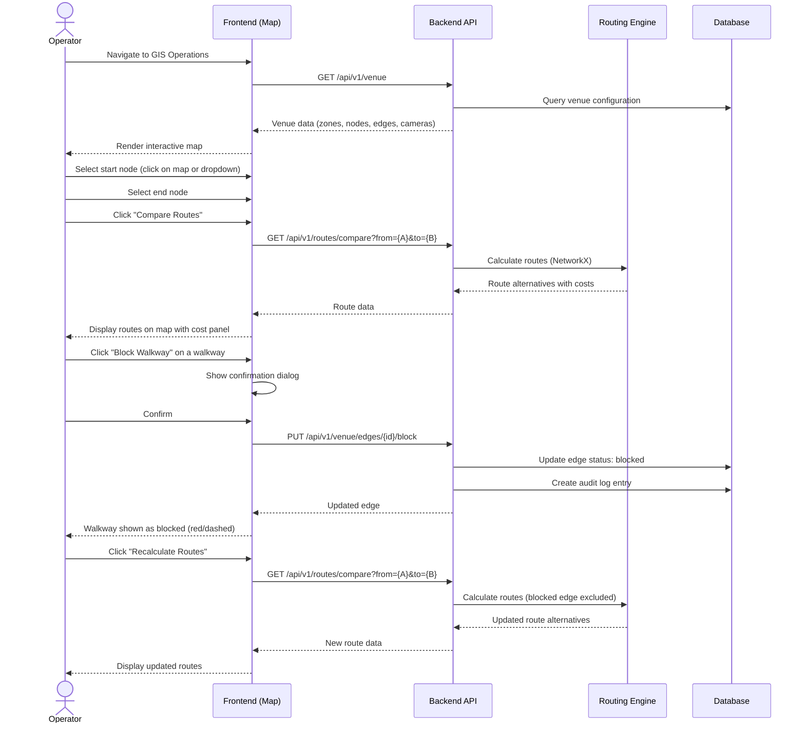
```mermaid
sequenceDiagram
    actor Op as Operator
    participant UI as Frontend (Map)
    participant API as Backend API
    participant GIS as Routing Engine
    participant DB as Database
    
    Op->>UI: Navigate to GIS Operations
    UI->>API: GET /api/v1/venue
    API->>DB: Query venue configuration
    API-->>UI: Venue data (zones, nodes, edges, cameras)
    UI-->>Op: Render interactive map
    
    Op->>UI: Select start node (click on map or dropdown)
    Op->>UI: Select end node
    Op->>UI: Click "Compare Routes"
    UI->>API: GET /api/v1/routes/compare?from={A}&to={B}
    API->>GIS: Calculate routes (NetworkX)
    GIS-->>API: Route alternatives with costs
    API-->>UI: Route data
    UI-->>Op: Display routes on map with cost panel
    
    Op->>UI: Click "Block Walkway" on a walkway
    UI->>UI: Show confirmation dialog
    Op->>UI: Confirm
    UI->>API: PUT /api/v1/venue/edges/{id}/block
    API->>DB: Update edge status: blocked
    API->>DB: Create audit log entry
    API-->>UI: Updated edge
    UI-->>Op: Walkway shown as blocked (red/dashed)
    
    Op->>UI: Click "Recalculate Routes"
    UI->>API: GET /api/v1/routes/compare?from={A}&to={B}
    API->>GIS: Calculate routes (blocked edge excluded)
    GIS-->>API: Updated route alternatives
    API-->>UI: New route data
    UI-->>Op: Display updated routes
```

### 5.2 Error Flow — No Valid Route

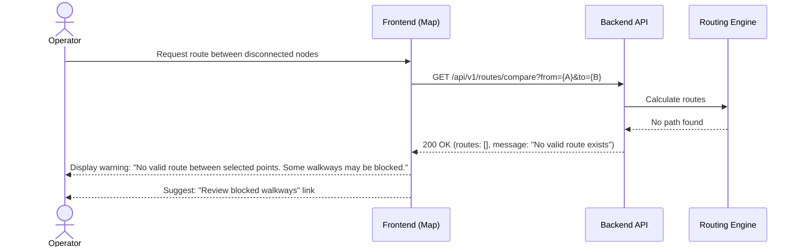
```mermaid
sequenceDiagram
    actor Op as Operator
    participant UI as Frontend (Map)
    participant API as Backend API
    participant GIS as Routing Engine
    
    Op->>UI: Request route between disconnected nodes
    UI->>API: GET /api/v1/routes/compare?from={A}&to={B}
    API->>GIS: Calculate routes
    GIS-->>API: No path found
    API-->>UI: 200 OK (routes: [], message: "No valid route exists")
    UI-->>Op: Display warning: "No valid route between selected points. Some walkways may be blocked."
    UI-->>Op: Suggest: "Review blocked walkways" link
```

## 6. Incident Creation and Assignment Flow

### 6.1 Normal Flow

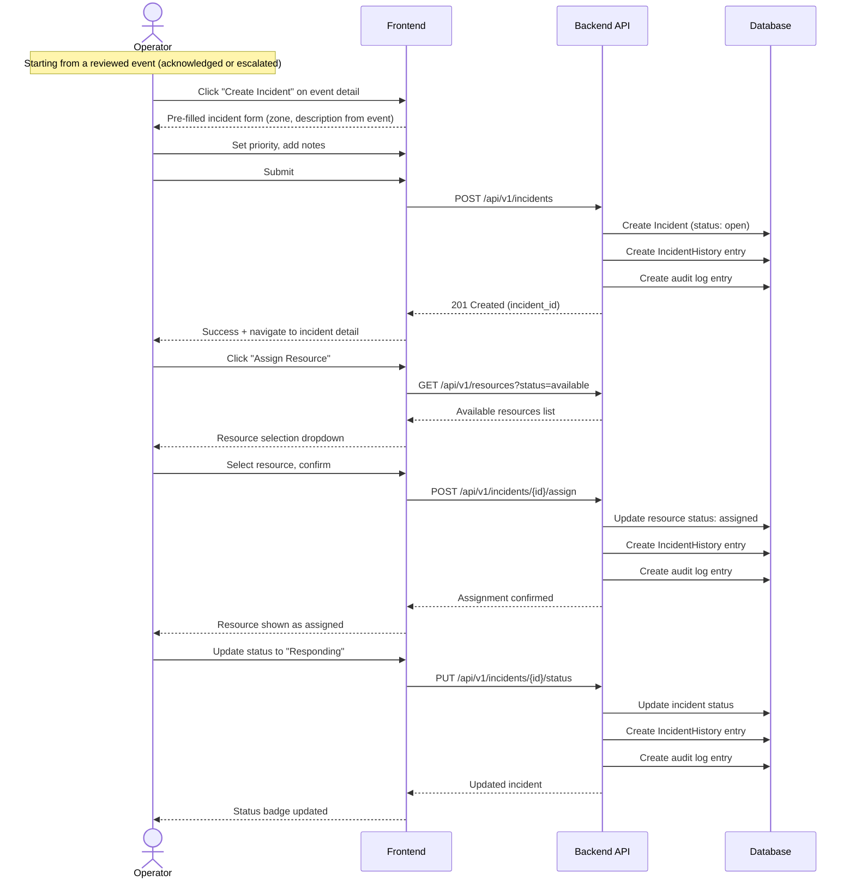
```mermaid
sequenceDiagram
    actor Op as Operator
    participant UI as Frontend
    participant API as Backend API
    participant DB as Database
    
    Note over Op: Starting from a reviewed event (acknowledged or escalated)
    
    Op->>UI: Click "Create Incident" on event detail
    UI-->>Op: Pre-filled incident form (zone, description from event)
    Op->>UI: Set priority, add notes
    Op->>UI: Submit
    UI->>API: POST /api/v1/incidents
    API->>DB: Create Incident (status: open)
    API->>DB: Create IncidentHistory entry
    API->>DB: Create audit log entry
    API-->>UI: 201 Created (incident_id)
    UI-->>Op: Success + navigate to incident detail
    
    Op->>UI: Click "Assign Resource"
    UI->>API: GET /api/v1/resources?status=available
    API-->>UI: Available resources list
    UI-->>Op: Resource selection dropdown
    Op->>UI: Select resource, confirm
    UI->>API: POST /api/v1/incidents/{id}/assign
    API->>DB: Update resource status: assigned
    API->>DB: Create IncidentHistory entry
    API->>DB: Create audit log entry
    API-->>UI: Assignment confirmed
    UI-->>Op: Resource shown as assigned
    
    Op->>UI: Update status to "Responding"
    UI->>API: PUT /api/v1/incidents/{id}/status
    API->>DB: Update incident status
    API->>DB: Create IncidentHistory entry
    API->>DB: Create audit log entry
    API-->>UI: Updated incident
    UI-->>Op: Status badge updated
```

### 6.2 Error Flow — Invalid Resource Assignment

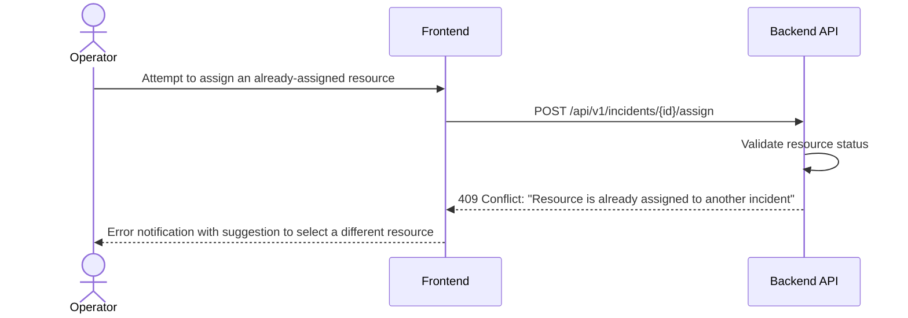
```mermaid
sequenceDiagram
    actor Op as Operator
    participant UI as Frontend
    participant API as Backend API
    
    Op->>UI: Attempt to assign an already-assigned resource
    UI->>API: POST /api/v1/incidents/{id}/assign
    API->>API: Validate resource status
    API-->>UI: 409 Conflict: "Resource is already assigned to another incident"
    UI-->>Op: Error notification with suggestion to select a different resource
```

## 7. Error and Recovery Flows

### 7.1 Network Error During API Call

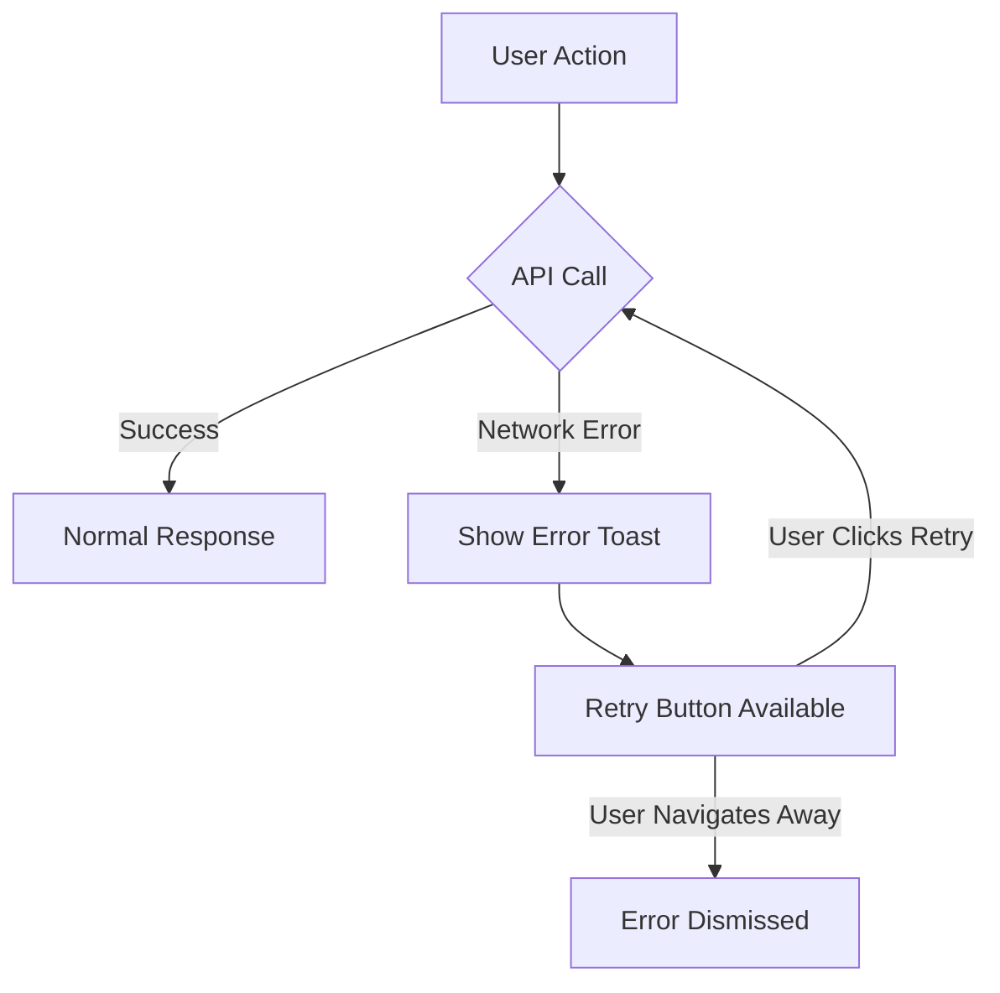
```mermaid
flowchart TD
    A[User Action] --> B{API Call}
    B -->|Success| C[Normal Response]
    B -->|Network Error| D[Show Error Toast]
    D --> E[Retry Button Available]
    E -->|User Clicks Retry| B
    E -->|User Navigates Away| F[Error Dismissed]
```

### 7.2 YOLO Model Not Available

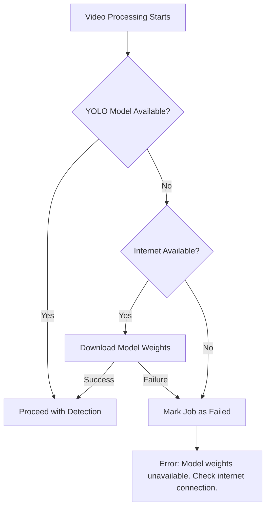
```mermaid
flowchart TD
    A[Video Processing Starts] --> B{YOLO Model Available?}
    B -->|Yes| C[Proceed with Detection]
    B -->|No| D{Internet Available?}
    D -->|Yes| E[Download Model Weights]
    E -->|Success| C
    E -->|Failure| F[Mark Job as Failed]
    D -->|No| F
    F --> G[Error: Model weights unavailable. Check internet connection.]
```

### 7.3 Map Tile Server Unavailable

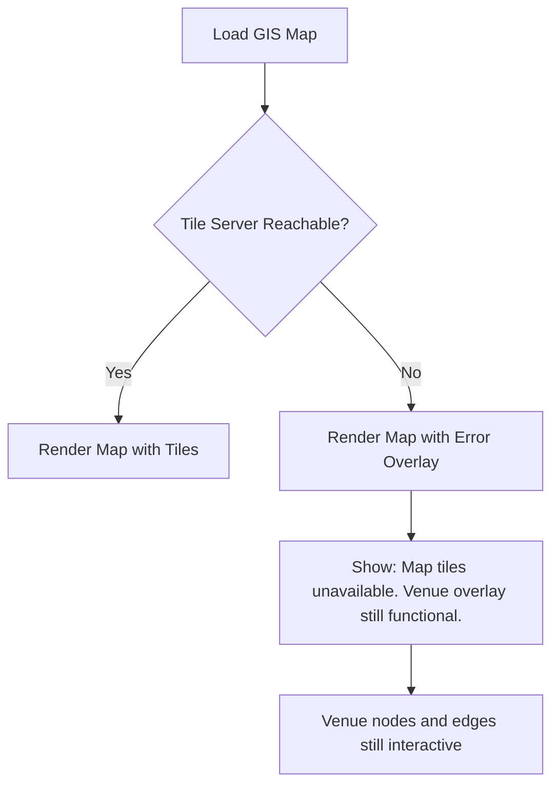
```mermaid
flowchart TD
    A[Load GIS Map] --> B{Tile Server Reachable?}
    B -->|Yes| C[Render Map with Tiles]
    B -->|No| D[Render Map with Error Overlay]
    D --> E[Show: Map tiles unavailable. Venue overlay still functional.]
    E --> F[Venue nodes and edges still interactive]
```

## 8. Processing, Success, Failure, and Retry States

| State | UI Indicator | User Action Available |
|-------|-------------|----------------------|
| **Uploading** | Progress bar with percentage | Cancel upload |
| **Queued** | Clock icon + "Waiting to process" | View queue position |
| **Processing** | Animated spinner + frame count progress | View partial results (P1) |
| **Completed** | Green checkmark + "Analysis complete" | View results, review events |
| **Failed** | Red X + error message | Retry upload, view error details |
| **Loading (any page)** | Skeleton screen or spinner | Wait or navigate away |
| **Empty** | Illustration + helpful message + CTA | Primary action button |
| **Error (API)** | Red toast notification | Retry or navigate |
| **Success (action)** | Green toast notification | Auto-dismiss after 5 seconds |

## 9. Navigation Hierarchy

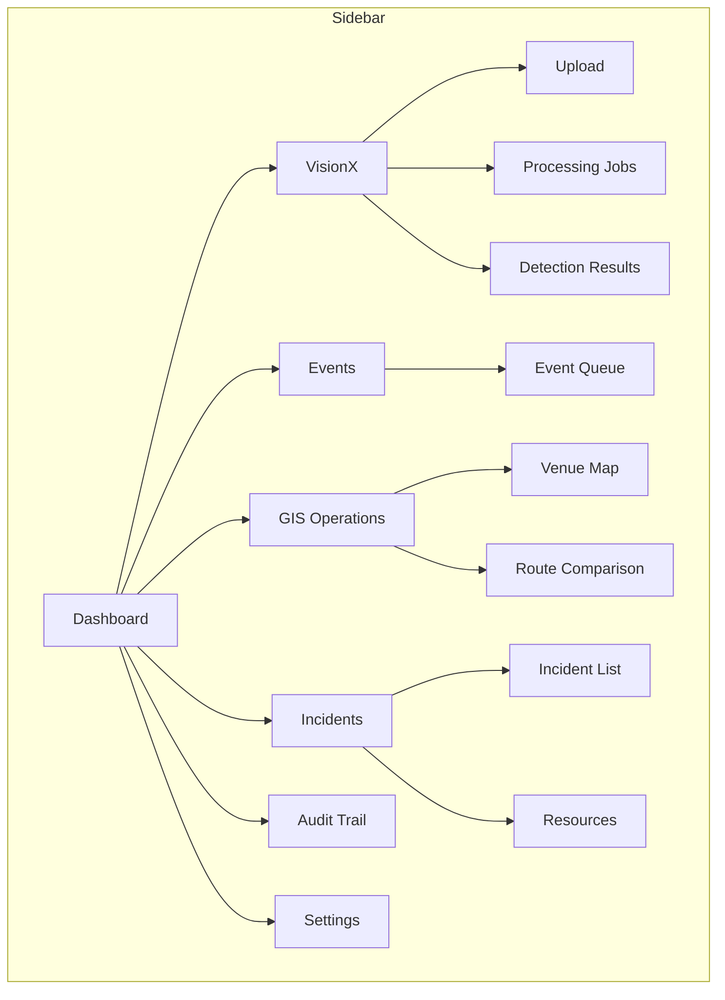
```mermaid
flowchart TD
    subgraph Sidebar
        DASH[Dashboard]
        VX[VisionX]
        VX1[Upload]
        VX2[Processing Jobs]
        VX3[Detection Results]
        EVT[Events]
        EVT1[Event Queue]
        GIS[GIS Operations]
        GIS1[Venue Map]
        GIS2[Route Comparison]
        INC[Incidents]
        INC1[Incident List]
        INC2[Resources]
        AUD[Audit Trail]
        SET[Settings]
    end
    
    DASH --> VX
    VX --> VX1
    VX --> VX2
    VX --> VX3
    DASH --> EVT
    EVT --> EVT1
    DASH --> GIS
    GIS --> GIS1
    GIS --> GIS2
    DASH --> INC
    INC --> INC1
    INC --> INC2
    DASH --> AUD
    DASH --> SET
```

### Navigation Rules
1. **Sidebar:** Always visible on desktop; collapsible on tablet.
2. **Top bar:** Shows current page title, breadcrumb, and notification count.
3. **Cross-links:** Events link to their zone on the map; incidents link back to their source event.
4. **Deep linking:** Every major entity (job, event, incident) has a direct URL.
5. **Back navigation:** Browser back button works correctly (React Router).

## 10. State Transition Diagrams

### 10.1 Video Job States

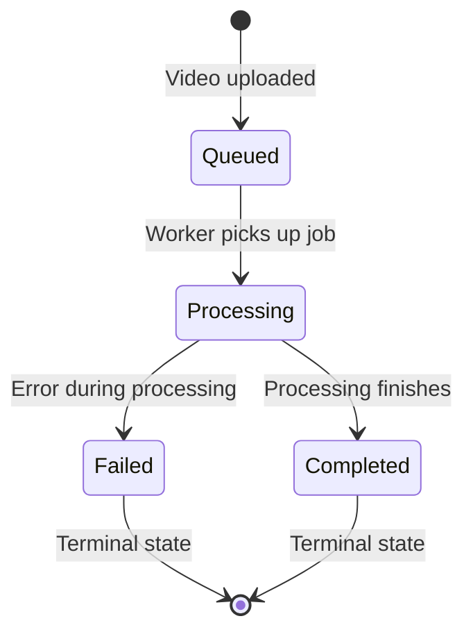
```mermaid
stateDiagram-v2
    [*] --> Queued: Video uploaded
    Queued --> Processing: Worker picks up job
    Processing --> Completed: Processing finishes
    Processing --> Failed: Error during processing
    Failed --> [*]: Terminal state
    Completed --> [*]: Terminal state
```

### 10.2 Event States

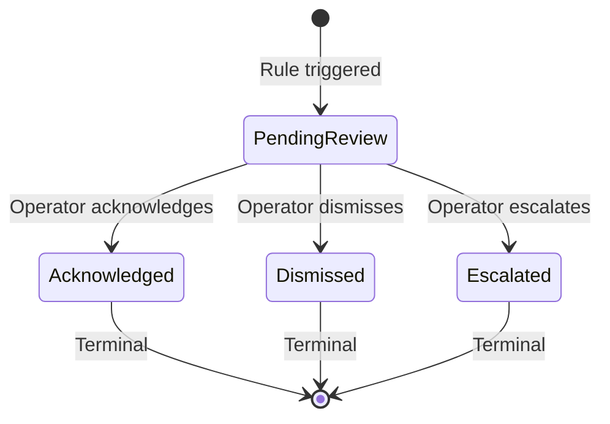
```mermaid
stateDiagram-v2
    [*] --> PendingReview: Rule triggered
    PendingReview --> Acknowledged: Operator acknowledges
    PendingReview --> Dismissed: Operator dismisses
    PendingReview --> Escalated: Operator escalates
    Acknowledged --> [*]: Terminal
    Dismissed --> [*]: Terminal
    Escalated --> [*]: Terminal
```

### 10.3 Incident States

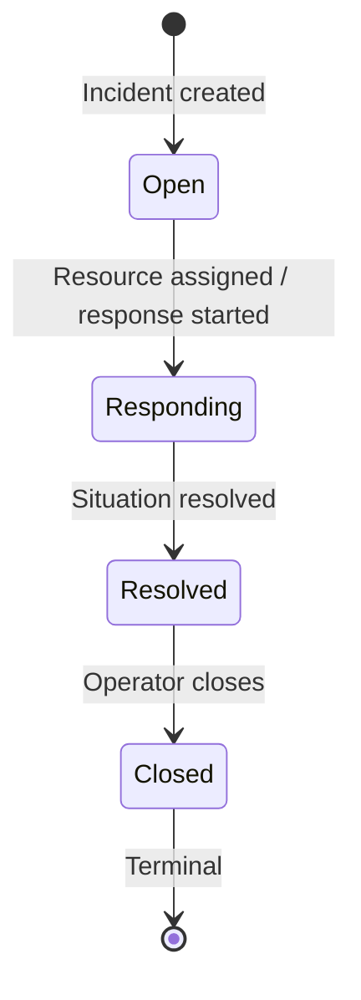
```mermaid
stateDiagram-v2
    [*] --> Open: Incident created
    Open --> Responding: Resource assigned / response started
    Responding --> Resolved: Situation resolved
    Resolved --> Closed: Operator closes
    Closed --> [*]: Terminal
```

### 10.4 Resource States

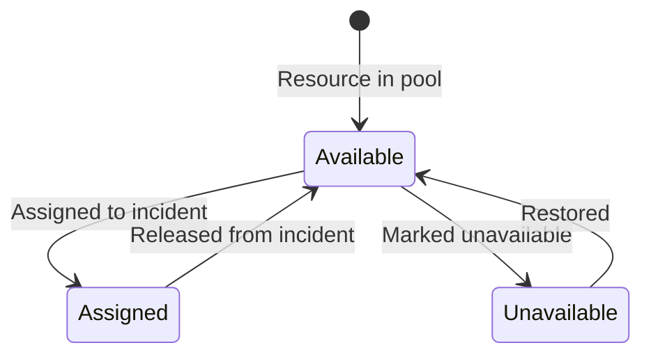
```mermaid
stateDiagram-v2
    [*] --> Available: Resource in pool
    Available --> Assigned: Assigned to incident
    Assigned --> Available: Released from incident
    Available --> Unavailable: Marked unavailable
    Unavailable --> Available: Restored
```

---

*End of Document 04 — User Journeys and Application Flow*
